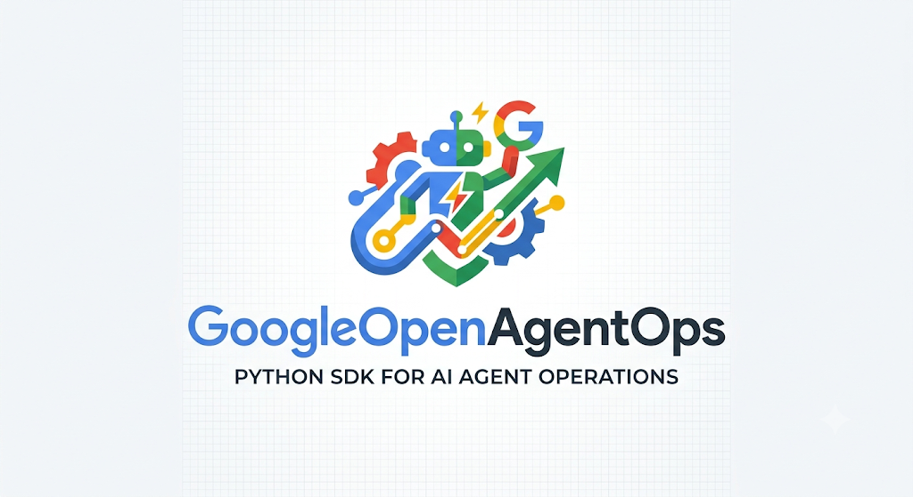

<div align="center">
  <br />
  
  <br /><br />
  <h3>Google Cloud Native & Open Source Observability, Telemetry and DevTool Platform for AI Agents & Multi-Agent Swarms</h3>
  <br />
</div>

<div align="center">
  <a href="https://pypi.org/project/GoogleOpenAgentOps/">
    
  </a>
  <a href="https://pypi.org/project/GoogleOpenAgentOps/">
    
  </a>
  <a href="https://github.com/abhimanyu/GoogleOpenAgentOps/actions">
    
  </a>
  <a href="https://opensource.org/licenses/MIT">
    
  </a>
  <a href="https://cloud.google.com/run">
    
  </a>
  <a href="https://ai.google.dev">
    
  </a>
</div>

<br />

<div align="center">
  <pre>
  ┌────────────────────────────────────────────────────────────────────────────────────────┐
  │                                                                                        │
  │     ██████╗  ██████╗  ██████╗  ██████╗ ██╗     ███████╗   ██████╗ ██████╗ ███████╗     │
  │    ██╔════╝ ██╔═══██╗██╔═══██╗██╔════╝ ██║     ██╔════╝  ██╔═══██╗██╔══██╗██╔════╝     │
  │    ██║  ███╗██║   ██║██║   ██║██║  ███╗██║     █████╗    ██║   ██║██████╔╝███████╗     │
  │    ██║   ██║██║   ██║██║   ██║██║   ██║██║     ██╔══╝    ██║   ██║██╔═══╝ ╚════██║     │
  │    ╚██████╔╝╚██████╔╝╚██████╔╝╚██████╔╝███████╗███████╗  ╚██████╔╝██║     ███████║     │
  │     ╚═════╝  ╚═════╝  ╚═════╝  ╚═════╝ ╚══════╝╚══════╝   ╚═════╝ ╚═╝     ╚══════╝     │
  │                                                                                        │
  │            ENTERPRISE OBSERVABILITY & REPLAY ENGINE FOR GOOGLE CLOUD & ADK            │
  └────────────────────────────────────────────────────────────────────────────────────────┘
  </pre>
</div>

<p align="center">
  <a href="#quick-start-"><strong>Quick Start</strong></a> •
  <a href="#linking-multiple-google-adk-agent-solutions-"><strong>Multi-ADK Linking</strong></a> •
  <a href="#1-click-gcp-cloud-run-deployment-"><strong>Cloud Run Auto-Deploy</strong></a> •
  <a href="#active-gemini-3x-pricing-"><strong>Gemini 3.x Economics</strong></a> •
  <a href="#jev-typesafe-ai-decision-engine-"><strong>Jev Decision Engine</strong></a> •
  <a href="#architecture-"><strong>Architecture</strong></a>
</p>

---

## 🌟 What is GoogleOpenAgentOps?

**GoogleOpenAgentOps** is a pip-installable, open-source AI agent observability and evaluation platform designed specifically for **Google Cloud Platform (GCP)** and **Google ADK (Agent Development Kit)** swarms.

Whether you run a single autonomous agent on your local machine, multi-agent swarms across Kubernetes/GKE, or distributed microservices on **Google Cloud Run**, GoogleOpenAgentOps unifies all execution traces, tool latencies, agent state machines, and token economics into one central live dashboard with **deep GCP Console linking**.

### ⚡ Highlights & Capabilities (v2.0)

| Feature | Description |
| :--- | :--- |
| 🎯 **AgentOps Parity Decorators** | `@session`, `@agent`, `@operation`, `@tool`, `@workflow`, `@guardrail` with 100% sync & async support |
| 🎬 **Interactive Session Replay** | Deterministic step-by-step timeline scrub, prompt inspections, thought loops, and tool parameters |
| 🚀 **CI/CD Pipeline Telemetry** | Build status, container releases, and commit traces from GitHub Actions and Google Cloud Build |
| 📊 **Real-time State Machine** | Live visualization of agent lifecycle transitions (`IDLE` ➔ `INITIALIZING` ➔ `THINKING` ➔ `TOOL_CALLING` ➔ `COMPLETED` / `FAILED`) |
| 💸 **Active Gemini 3.x Economics** | Exact cost calculation for `gemini-3.8-flash`, `gemini-3.5-flash`, and `gemini-3.8-live` foundation models |
| 🤝 **Multi-Solution ADK Linking** | Seamlessly connect multiple independent ADK agent applications into one central dashboard |
| ☁️ **GCP Auto-Adaptation** | Auto-detects Cloud Run, GKE, Vertex AI, GCE, project IDs, and ADC credentials; exports to Cloud Trace, Monitoring, and Logging |
| 🔗 **OpenInference & OTel Native** | Spans, tokens, and trace context natively formatted according to OpenInference semantic conventions |

---

## 🔌 Key Integrations

<div align="center">

| Framework | Status | Supported Features |
| :--- | :---: | :--- |
| **Google ADK (Agent Development Kit)** | 🟢 Native | Multi-solution registration, agent decorators, tool spans, handoffs |
| **AgentOps Parity API** | 🟢 Native | `@session`, `@agent`, `@operation`, `@tool`, `@workflow`, `@guardrail` |
| **Google Gemini 3.x API** | 🟢 Native | `gemini-3.8-flash`, `gemini-3.5-flash`, `gemini-3.8-live` pricing & tokens |
| **Google Cloud Run & Cloud Build** | 🟢 Native | CI/CD build telemetry, 1-click deploy, container runtime auto-detection |
| **Google Cloud Trace & Logging** | 🟢 Native | Cloud Trace v2 exporter, `logging.googleapis.com/trace` log correlation |
| **LangChain & LangGraph** | 🟢 Native | Agent execution tracing, tool run timing, nested graph waterfalls |
| **CrewAI** | 🟢 Native | Hierarchical agent handoffs, crew task execution, agent roles |
| **AG2 (AutoGen)** | 🟢 Native | Multi-turn conversational group chats, agent handoffs, tool feedback |

</div>

---

## ⌨️ Quick Start

### 1. Installation

Install directly via `pip` from PyPI or GitHub:

```bash
# Core install
pip install GoogleOpenAgentOps

# With Google Cloud and OpenTelemetry exporters
pip install "GoogleOpenAgentOps[all]"
```

### 2. Complete AgentOps Workflow in Python

```python
import google_openagentops as agentops

# Initialize (auto-discovers GCP Project or GEMINI_API_KEY)
session = agentops.init(project_id="my-adk-project")

# 1. Tool Decorator
@agentops.tool(name="database_query")
def fetch_user_data(user_id: str):
    return {"user_id": user_id, "tier": "enterprise"}

# 2. Guardrail Decorator
@agentops.guardrail(name="SecurityGuardrail")
def check_safety(output: dict) -> bool:
    return "password" not in str(output)

# 3. Agent Decorator
@agentops.agent(name="CustomerSupportAgent", role="AI Assistant", model="gemini-3.8-flash")
def handle_support(user_id: str):
    data = fetch_user_data(user_id)
    response = {"message": f"Hello {data['user_id']}, you are on {data['tier']} tier."}
    check_safety(response)
    return response

# 4. Top-level Session / Workflow
@agentops.session(session_name="Enterprise Customer Session")
def run():
    return handle_support("usr-8492")

run()
```

Launch the local visual dashboard:
```bash
google-openagentops serve --port 8000
```

Open [http://localhost:8000](http://localhost:8000) to view live state transitions, trace spans, and token spending!

---

## 🤝 Linking Multiple Google ADK Agent Solutions

One of the most powerful capabilities of **GoogleOpenAgentOps** is the ability to link **multiple independent Google ADK agent solutions** into a single central dashboard. 

For example, imagine you have:
1. **Solution A**: Customer Support Bot (`SupportBot-ADK`)
2. **Solution B**: Financial Auditor Agent (`FinancialAuditor-ADK`)

Both can run in separate environments (e.g. Cloud Functions, Cloud Run microservices, or local workstations) and stream correlated traces, tool calls, and cross-agent handoffs directly into the central dashboard:

```python
import time
import google_openagentops as agentops
from google_openagentops.integrations.adk import GoogleADKTracker

# Initialize central tracker or point to your deployed Cloud Run URL
agentops.init(project_id="my-gcp-enterprise-project")

# -------------------------------------------------------------
# Solution 1: Customer Support Bot (using fast Gemini 3.5 Flash)
# -------------------------------------------------------------
support_solution = GoogleADKTracker(
    solution_id="sol-customer-support",
    solution_name="SupportBot-ADK",
    default_model="gemini-3.5-flash",
    dashboard_url="https://google-openagentops-dashboard-xyz.a.run.app"  # Your Cloud Run dashboard
)

# -------------------------------------------------------------
# Solution 2: Financial Auditor Agent (using deep Gemini 3.8 Flash)
# -------------------------------------------------------------
auditor_solution = GoogleADKTracker(
    solution_id="sol-financial-auditor",
    solution_name="FinancialAuditor-ADK",
    default_model="gemini-3.8-flash",
    dashboard_url="https://google-openagentops-dashboard-xyz.a.run.app"
)

# --- Instrument Solution A Agent ---
@support_solution.track_agent(agent_name="TicketTriageAgent")
def triage_ticket(ticket_text: str):
    if "refund" in ticket_text.lower():
        # Record cross-solution handoff to Financial Auditor
        support_solution.record_handoff(
            target_agent="FinancialAuditor-ADK",
            context={"ticket": ticket_text, "action": "Escalate to Finance"}
        )
        return {"action": "ESCALATED", "target": "FinancialAuditor"}
    return {"action": "RESOLVED"}

# --- Instrument Solution B Tool & Agent ---
@auditor_solution.track_tool(tool_name="QueryBigQueryLedger")
def verify_transaction(tx_id: str):
    # Simulated BigQuery ledger query
    time.sleep(0.04)
    return {"tx_id": tx_id, "amount_usd": 450.00, "verified": True}

@auditor_solution.track_agent(agent_name="RefundReconciliationAgent")
def process_audit(ticket_data: dict):
    ledger_status = verify_transaction("TX-99824")
    return {
        "status": "APPROVED",
        "ledger": ledger_status,
        "note": "Refund authorized after ledger confirmation."
    }

# Execute Multi-Solution Flow
triage_res = triage_ticket("Customer request for $450 refund on invoice #99824")
if triage_res["action"] == "ESCALATED":
    audit_res = process_audit(triage_res)
    print("Multi-Solution Workflow Result:", audit_res)
```

In the dashboard, both solutions appear with individual health cards, unified execution traces, and shared token cost aggregation!

---

## 🚀 1-Click GCP Cloud Run Deployment & Automated Setup

Deploy the complete GoogleOpenAgentOps dashboard and telemetry backend to **Google Cloud Run** in a single automated step.

### Method 1: Via the Python CLI (`google-openagentops deploy`)

If you have `gcloud` installed locally:

```bash
# Deploy to Google Cloud Run with automatic compute configuration
google-openagentops deploy --project YOUR_PROJECT_ID --region us-central1
```

**What this automatically does:**
1. ✅ Checks for active GCP authentication & project credentials.
2. ✅ Enables required Google Cloud APIs (`run.googleapis.com`, `cloudbuild.googleapis.com`, `cloudtrace.googleapis.com`, `monitoring.googleapis.com`, `logging.googleapis.com`).
3. ✅ Builds and deploys the production container to Cloud Run with optimal compute runtime specifications:
   - **vCPU**: 1 Core
   - **Memory**: 512 MiB
   - **Port**: 8000
   - **Concurrency**: 80 requests
4. ✅ Returns the live HTTPS Cloud Run URL directly to your terminal and opens your default browser!

### Method 2: Remote SSH or Google Cloud Shell 1-Liner

When logging into a remote GCP VM, Bastion host, or Google Cloud Shell, run:

```bash
curl -sSL https://raw.githubusercontent.com/abhimanyu/GoogleOpenAgentOps/main/scripts/deploy_gcp.sh | bash
```

Or trigger remotely via SSH from your local workstation:

```bash
ssh user@your-gcp-vm 'bash -s' < scripts/deploy_gcp.sh
```

---

## 💸 Active Google Gemini 3.x Production Model Pricing

GoogleOpenAgentOps calculates precise token costs on every span using the active production pricing for Google Gemini 3.x models:

| Model | Input Price / Million | Output Price / Million | Best Suited For |
| :--- | :---: | :---: | :--- |
| **`gemini-3.8-flash`** | **$0.30** | **$1.20** | Deep autonomous reasoning, architectural planning, long-horizon coding |
| **`gemini-3.5-flash`** | **$0.10** | **$0.40** | High-velocity agent execution, rapid code edits, quick unit testing |
| **`gemini-3.8-live`** | **$0.60** | **$2.40** | Low-latency real-time bidirectional voice interactions & streaming |
| **`gemini-3.1-flash-image`** | **$0.50** | **$1.50** | Visual inspection, diagram generation, UI screenshot reasoning |
| **`gemini-3-pro-image`** | **$1.00** | **$3.00** | High-fidelity multimodal creative asset generation |

*Note: In compliance with Google Cloud policy, deprecated models (`gemini-1.0-pro`, PaLM, `text-bison`) are strictly excluded.*

---

## 🧠 Jev (Typesafe AI) Decision Engine

GoogleOpenAgentOps includes an embedded **Jev Decision Engine** (`jev.py`) that uses discrete typesafe scoring to choose optimal agent skills and Gemini 3.x model routes based on task complexity:

```python
from google_openagentops import evaluate_task, route_model

# Evaluate complexity of a proposed agent step
decision = evaluate_task(
    prompt="Design a distributed multi-agent swarm architecture with auto-failover on GCP",
    has_code=True,
    is_multimodal=False
)

print(f"Complexity Score: {decision.complexity_score}")   # e.g., 0.82
print(f"Recommended Model: {decision.recommended_model}")  # gemini-3.8-flash
print(f"Activated Skills:  {decision.activated_skills}")   # ['roo-code', 'GoogleOpenAgentOps']
```

---

## 🛠️ Decorators & Context Managers Reference

### Decorators

- `@agentops.track_agent(name="AgentName", role="Role", model="gemini-3.8-flash")`: Instruments agent method execution, recording state machine shifts and token consumption.
- `@agentops.track_tool(name="ToolName")`: Tracks tool invocation duration, parameter inputs, return payloads, and catches errors without breaking execution.
- `@adk_tracker.track_agent(...)`: Instruments an ADK agent with solution scoping.
- `@adk_tracker.track_tool(...)`: Instruments an ADK tool with solution scoping.

### Context Managers

```python
# Trace an entire multi-turn workflow
with agentops.start_trace(session_id="sess-100", name="OrderFulfillmentWorkflow"):
    with agentops.start_span(session_id="sess-100", name="ValidatePayment", span_kind="TOOL"):
        # Payment verification logic
        pass
```

---

## 🗺️ Roadmap & Community

- [x] **v1.0.0**: Core Python SDK, PyPI packaging, Google Cloud Run 1-Click Auto-Deployer.
- [x] **v1.0.0**: Multi-Solution Google ADK integration and correlation.
- [x] **v1.0.0**: Active Gemini 3.x token pricing and cost modeling.
- [x] **v1.0.0**: Google Cloud Trace v2, Cloud Monitoring, and Cloud Logging exporter.
- [ ] **v1.1.0**: Visual trace diffing across repeated agent benchmark runs.
- [ ] **v1.2.0**: Direct integration with Vertex AI Agent Builder & Reasoning Engines.
- [ ] **v1.3.0**: Native TypeScript / JavaScript SDK (`@google-openagentops/sdk`).

---

## 📜 License

GoogleOpenAgentOps is open-source software licensed under the **MIT License**. See [LICENSE](LICENSE) for details.

Developed with ❤️ by the Google AI Developer Community.
